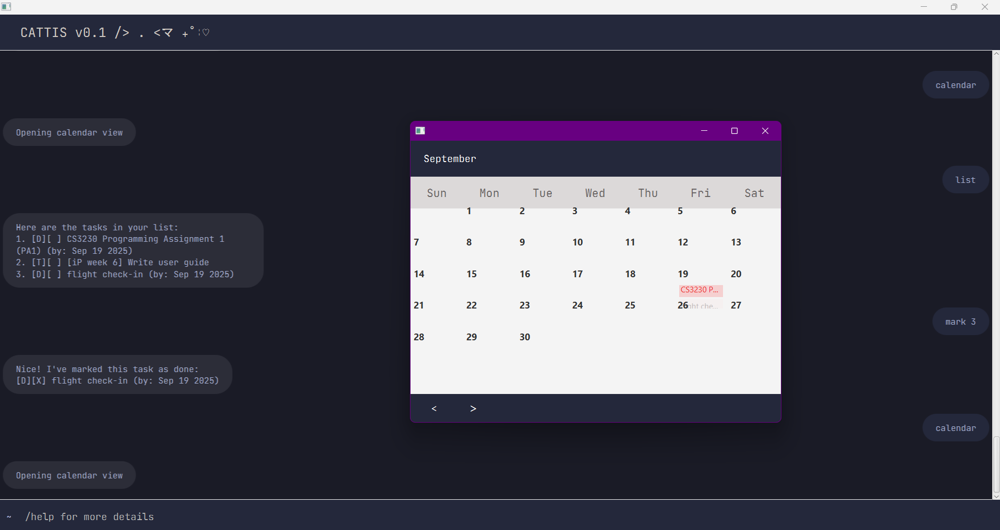

# CATTIS User Guide（• ˕ •マ.ᐟ



**CATTIS （• ˕ •マ.ᐟ** is a comprehensive **task manager**, optimized for used
via a Command-Line interface (CLI) while still having rich 
Graphical User Interface (GUI) such as flavorful chatbot and calendar view. 
Unlike traditional task manager program, if you are tech-savvy, CATTIS will be your life changer.

<!-- TOC -->
* [CATTIS User Guide（• ˕ •マ.ᐟ](#cattis-user-guide--マᐟ)
  * [Quick start](#quick-start)
  * [Features](#features)
    * [Viewing help `help`](#viewing-help-help)
    * [Calendar and Task Views `calendar`](#calendar-and-task-views-calendar)
      * [📅 Calendar View](#-calendar-view)
      * [View scheduled task `view`](#view-scheduled-task-view)
      * [List all tasks `list`](#list-all-tasks-list)
      * [Find task based on keyword `find`](#find-task-based-on-keyword-find)
    * [Task Creation](#task-creation)
      * [Adding todo tasks `todo`](#adding-todo-tasks-todo)
      * [Adding deadline tasks `deadline`](#adding-deadline-tasks-deadline)
      * [Adding event tasks `event`](#adding-event-tasks-event)
    * [🛠️ Task Management](#-task-management)
      * [Delete task `delete`](#delete-task-delete)
      * [Mark task as done `mark`](#mark-task-as-done-mark)
      * [Unmark task as done `unmark`](#unmark-task-as-done-unmark)
    * [Exit the program `bye`](#exit-the-program-bye)
<!-- TOC -->

## Quick start
- Download the latest `.jar` version from the 
GitHub repository.
- Open a command terminal and navigate to the directory containing `.jar` file.
- Run `java -jar cattis.jar` to start the application.
- Type the command in the command box below. You can type `help` to
list all features CATTIS offer.

## Features

> **Important:** General format for commands
> - Task names can include any characters, including 
> spaces and forward-slash, except `/by`, `/from` and `/to`.
> - Dates should be in `YYYY-MM-DD` format. 
> - If CATTIS discovers any formatting errors, the user will get notified by 
> this message: `OOPS! Parsing error for [command]`.

### Viewing help `help`
Shows a message explaining how to use the application.

### Calendar and Task Views `calendar`
#### 📅 Calendar View
Shows the calendar view of all deadline and event tasks.

#### View scheduled task `view`
Shows all tasks scheduled for a specific date. 
- For deadline tasks, CATTIS will use deadline date as a reference.
- For event tasks, CATTIS will use both start date and end date as a reference.

> `view [date]`

Example: `view 2025-09-19`
```
[D][ ] CS3230 Programming Assignment (by: Sep 19 2025)
```

#### List all tasks `list`
Shows all tasks currently in the system.
```
[D][ ] CS3230 Programming Assignment (by: Sep 19 2025)
[T][X] iP Week 5 
```

#### Find task based on keyword `find`
Shows all tasks that contain the specific keyword specified by user.
> `find [keyword]`

Example: `find CS`
```
[D][ ] CS3230 Programming Assignment (by: Sep 19 2025)
[T][X] CS2103T iP Week 5
```
Example: `find :)`
```
<empty>
```
### Task Creation

#### Adding todo tasks `todo`
> `todo [taskName]`

Example: `todo iP Week 5`
```
Got it. I've added this task:
[T][ ] iP Week 5 
```
#### Adding deadline tasks `deadline`
> `deadline [taskName] /by [deadline]`

Example: `deadline iP Week 5 /by 2025-09-19`
```
Got it. I've added this task:
[D][ ] iP Week 5 (by: Sep 19 2025)
```
#### Adding event tasks `event`
> `event [taskName] /from [startDate] /to [endDate]`

Example: `event iP Week 5 /from 2025-09-17 /to 2025-09-19`

```
Got it. I've added this task:
[E][ ] iP Week 5  (from: Sep 17 2025 to: Sep 19 2025)
```

### 🛠️ Task Management
Task management involves accessing a specific task based on its index. 
Make sure that the accessed element is within the bound. Otherwise, the user
will receive this message.
```
OOPS! Tasks out of bounded
```
#### Delete task `delete`
Removes a task by its index.
> `delete [index]`  

Example: `delete 3`

```
Noted! I've removed this task.
[D][ ] iP Week 5 (by: Sep 19 2025)
```

#### Mark task as done `mark`
Marks the task as completed.
> `mark [index]`

Example: `mark 3`

```
Nice! I've marked this task as done.
[D][X] iP Week 5 (by: Sep 19 2025)
```

#### Unmark task as done `unmark`
Mark the task as uncompleted.
> `unmark [index]`

Example: `mark 3`

```
Nice! I've marked this task as not done yet.
[D][ ] iP Week 5 (by: Sep 19 2025)
```

### Exit the program `bye`
Simply type `bye` to exit the program.